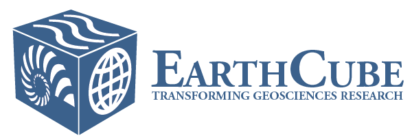

<a href="http://earthcube.org/" target="_blank">
<a href="https://nsf.gov/" target="_blank">
 
 

## Jul 25, 2022 Workshop Plenary Presentations
  * [RCN -Determining Best Practices for Preservation and Replicability of Model Data, Gretchen Mullendore, Doug Schuster, Matt Mayernik, NCAR](2022-UND-Workshop-RCN-Overview.pdf) 
  * [Sustainable Data and Software Curation?!, Susan Borda, UMich](DataCuration.pptx.pdf) 
  * [Determining Lifetime for Simulation Data, how to evaluate when data can be de-accessed from a repository -A scientist perspective, Cindy Bruyere, UCAR/CPAESS](DataWorkshop_ND_Bruyere.pptx.pdf)
  * [Steps Toward Incetivizing data and software sharing, Chris Erdmann, AGU](2022-07-25-erdmann-incentives-modelrcn.pdf)
  * [Open Science and Equitable Research Opportunities, Including Equitable Access to Data and Software Curation Resources, Scott Collis, DOE](EC-RCN-Collis.pptx.pdf)
